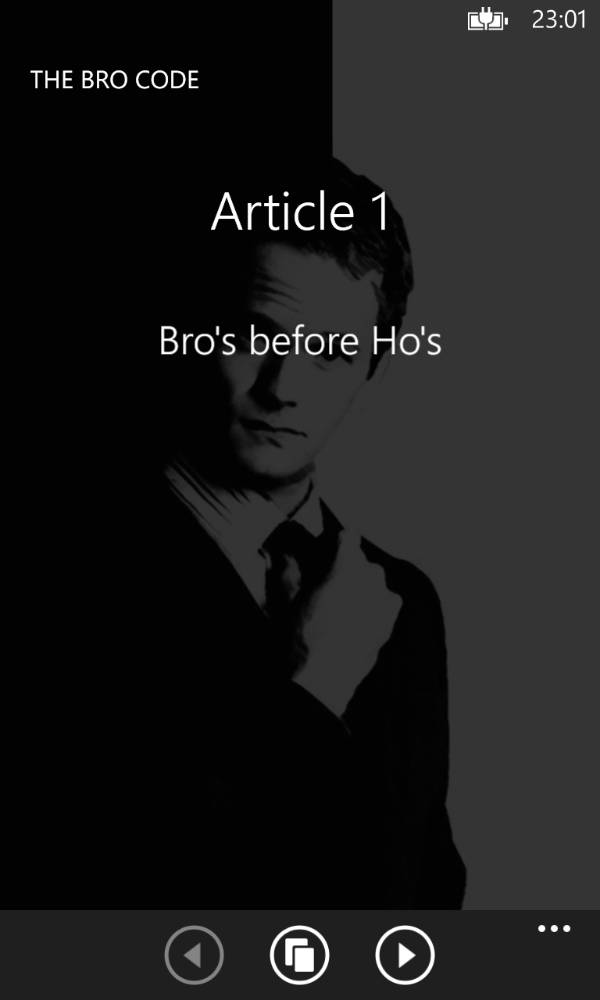
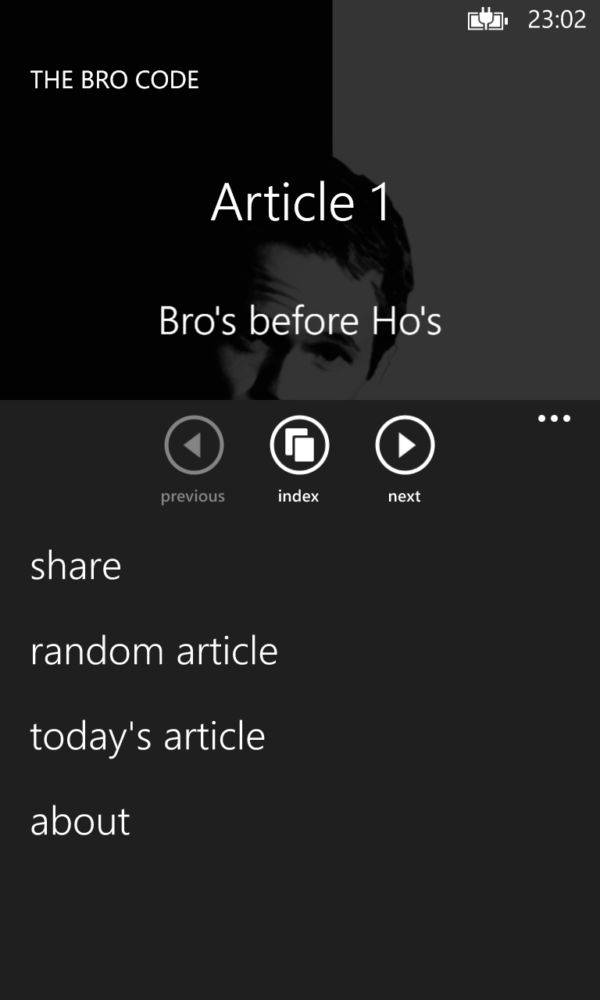
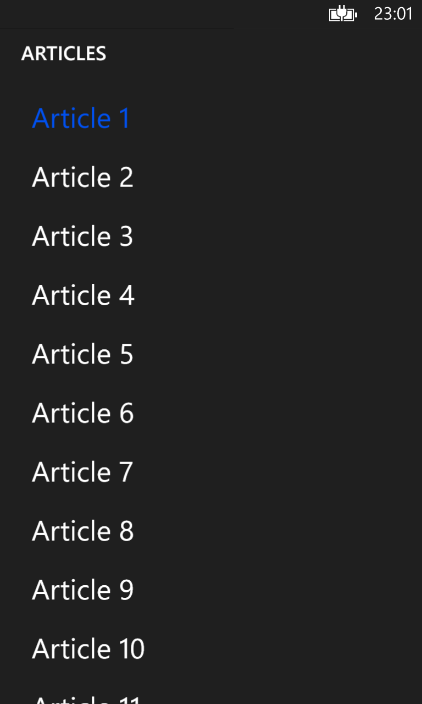

# PedroLamas.TheBroCode

Source files for the **The Bro Code** Windows Phone 8.x app.

## Original Description

> Based on “The Bro Code”, written by the awesome Barney Stinson.
>
> Containing approximately 150 “unspoken” rules, this code of conduct ranges from the simple (bros before hos) to the complex (the hot-to-crazy ratio, complete with bar graphs and charts).

## Logo

## Screenshots

